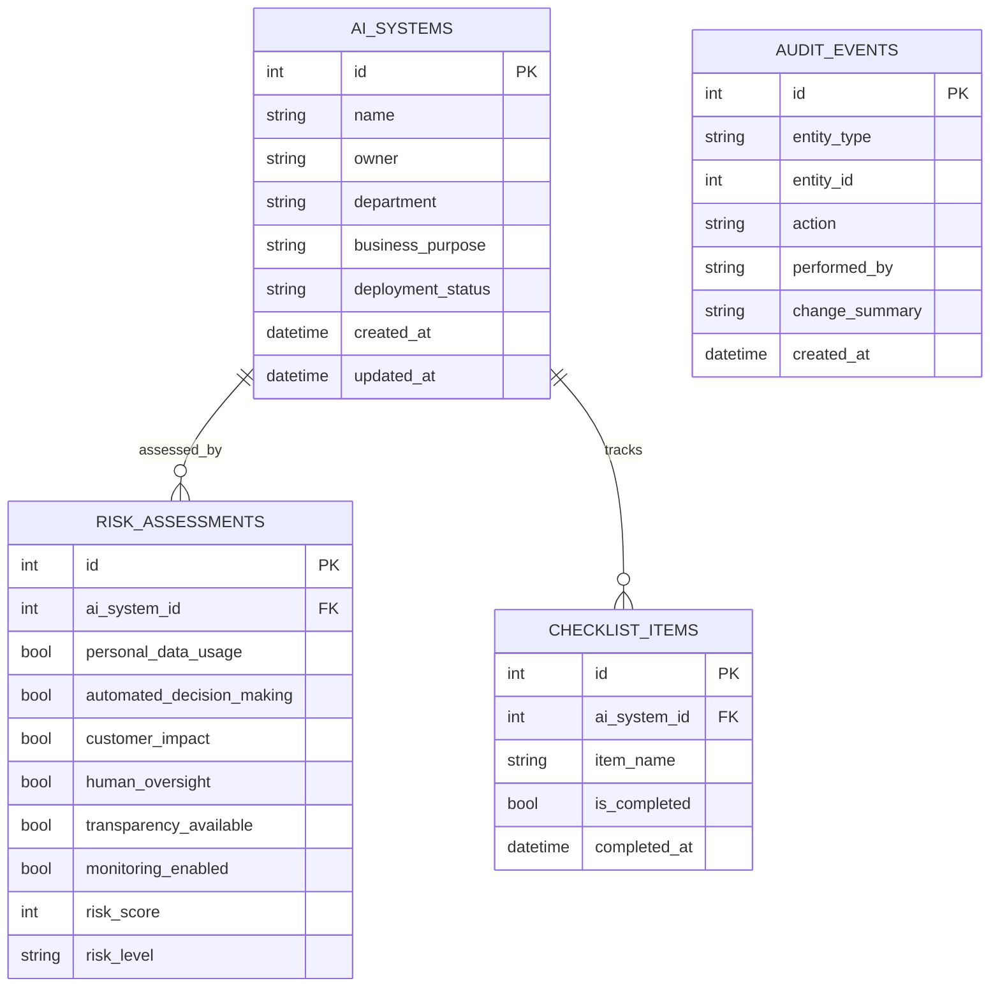

# Data model

```mermaid
erDiagram
    AI_SYSTEMS ||--o{ RISK_ASSESSMENTS : assessed_by
    AI_SYSTEMS ||--o{ CHECKLIST_ITEMS : tracks
    AI_SYSTEMS {
        int id PK
        string name
        string owner
        string department
        string business_purpose
        string deployment_status
        datetime created_at
        datetime updated_at
    }
    RISK_ASSESSMENTS {
        int id PK
        int ai_system_id FK
        bool personal_data_usage
        bool automated_decision_making
        bool customer_impact
        bool human_oversight
        bool transparency_available
        bool monitoring_enabled
        int risk_score
        string risk_level
    }
    CHECKLIST_ITEMS {
        int id PK
        int ai_system_id FK
        string item_name
        bool is_completed
        datetime completed_at
    }
    AUDIT_EVENTS {
        int id PK
        string entity_type
        int entity_id
        string action
        string performed_by
        string change_summary
        datetime created_at
    }
```

Deleting a system removes its assessments and checklist items. Audit rows are append-only records and are retained independently.
